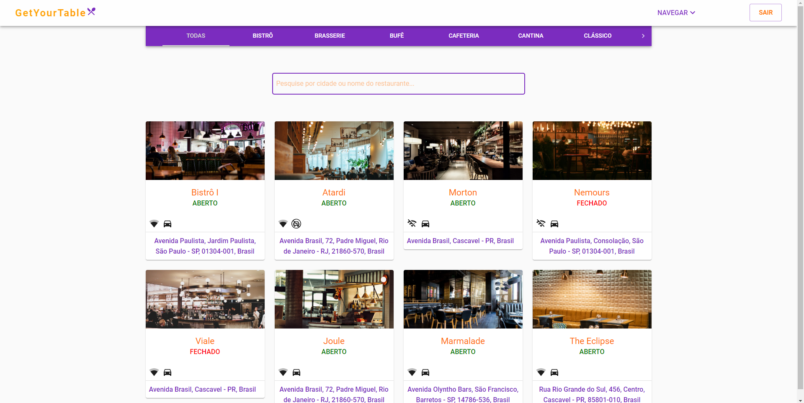
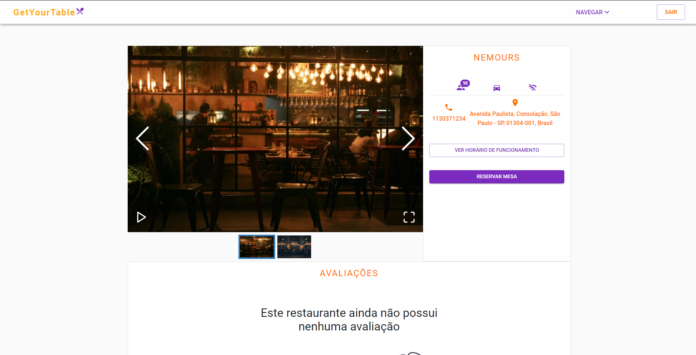
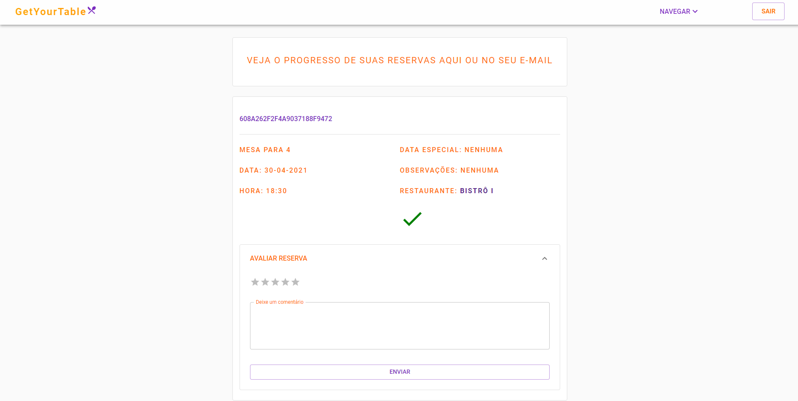
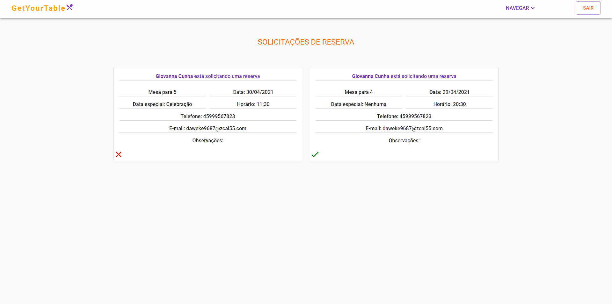
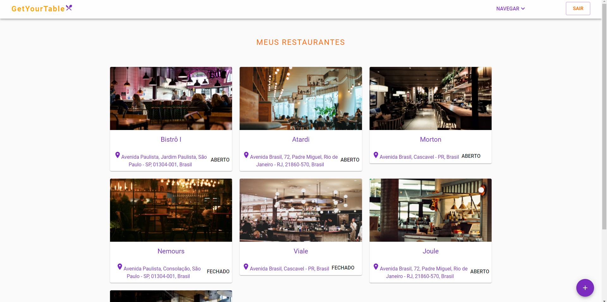

# 📃 GetYourTable

## See preview here: https://getyourtable.tk/
## Server Repository https://github.com/GiovannaK/Restaurant-Booking-server
### Demo Credentials
#### Normal user
- E-MAIL: yeway40067@goqoez.com
- PASSWORD: getyourtable

#### Restaurant manager user
- E-MAIL: mimepam980@httptuan.com
- PASSWORD: getyourtable

---











<p align="center">
  <a href="#description">Description</a>&nbsp;&nbsp;&nbsp;|&nbsp;&nbsp;&nbsp;
  <a href="#features">Features</a>&nbsp;&nbsp;&nbsp;|&nbsp;&nbsp;&nbsp;
  <a href="#how-to-use">How to Use</a>&nbsp;&nbsp;&nbsp;|&nbsp;&nbsp;&nbsp;
  <a href="#license">License</a>&nbsp;&nbsp;&nbsp;|&nbsp;&nbsp;&nbsp;
  <a href="#author-info">Author Info</a>
</p>

---

## Description
GetYourTable is a web app for restaurant table booking. It is possible to manage restaurants and bookings for each restaurant separately in real time. In addition to making bookings at specific times with special requests and receiving response to the request in real time and by email.

## Technologies

### Front-end
- ReactJs
- Material UI

### Services

- HERE Geocoder API for geolocation functionality -> https://developer.here.com/documentation/geocoder/dev_guide/topics/what-is.html

---
## Features

### REGISTRATION

### There are two types of primary users. Restaurant manager and users who request reservations. You can register using name, last name, email, password and phone number.

### ACCOUNT ACTIVATION
- When a user finish registration proccess, before login, the account must be activated. A short expiration token will be sent to the user's email.

### LOGIN

- It is possible to log in using e-mail and password, if account is not activated it will not be possible to login.

### FORGOT PASSWORD

- Users can recover access to the account by requesting a password change.
- A short expiration token will be sent to the user's email with a link to the password reset form.

### PROFILE

- Users can change their personal data
- Track bookings in real time and receive an email if booking was approved or rejected

### RESTAURANT MANAGER PROFILE

- Can change their personal data
- Manage multiple restaurants
- Create new restaurants
- Update restaurants information
- Upload restaurant images (drag and drop)
- Track real-time bookings for each restaurant separately

### AUTOCOMPLETE ADDRESS
- It is possible type your restaurant address and select autocomplete suggestions

### SEARCH
- It is possible to search restaurants by name and city

### CATEGORIES

- 20 restaurant categories 

### BOOKINGS
- Users can choose how many companions will take
- Choose dates according to the restaurant's opening hours
- it is possible to request additional

---
## How To Use

### Run locally

### Clone the project

```html
git clone https://github.com/GiovannaK/Restaurant-Booking-Client.git
```
### Assuming you already have NodeJS and npm installed and properly configured: Run the command below to install all required dependencies

```html
npm install
```
### Creating Environment variables. 

- create a .env file in the root folder

- Then add the following information and your credentials

```html
REACT_APP_BASE_URL = API URL you can get here and run -> https://github.com/GiovannaK/Restaurant-Booking-server.git

REACT_APP_HERE_KEY = For geolocation autocomplete you can create a free account and get your api key here -> https://developer.here.com/products/geocoding-and-search

```
### Finally run the project, it will initialized on port 3000

```html
npm start
```
---

## License

MIT License

Copyright (c) [2020]

Permission is hereby granted, free of charge, to any person obtaining a copy
of this software and associated documentation files (the "Software"), to deal
in the Software without restriction, including without limitation the rights
to use, copy, modify, merge, publish, distribute, sublicense, and/or sell
copies of the Software, and to permit persons to whom the Software is
furnished to do so, subject to the following conditions:

The above copyright notice and this permission notice shall be included in all
copies or substantial portions of the Software.

THE SOFTWARE IS PROVIDED "AS IS", WITHOUT WARRANTY OF ANY KIND, EXPRESS OR
IMPLIED, INCLUDING BUT NOT LIMITED TO THE WARRANTIES OF MERCHANTABILITY,
FITNESS FOR A PARTICULAR PURPOSE AND NONINFRINGEMENT. IN NO EVENT SHALL THE
AUTHORS OR COPYRIGHT HOLDERS BE LIABLE FOR ANY CLAIM, DAMAGES OR OTHER
LIABILITY, WHETHER IN AN ACTION OF CONTRACT, TORT OR OTHERWISE, ARISING FROM,
OUT OF OR IN CONNECTION WITH THE SOFTWARE OR THE USE OR OTHER DEALINGS IN THE
SOFTWARE.


---

## Author Info

- Linkedin - [Giovanna Cunha](https://www.linkedin.com/in/giovanna-kelli/)
